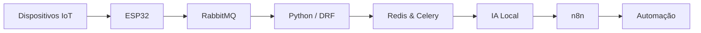

<div align="center">

# Renato David Soares de Oliveira

**Backend Developer • IoT Builder • Automation Enthusiast**

*"Construindo APIs durante o dia e inventando projetos malucos durante a noite."*

</div>

---

## Sobre mim

Sou desenvolvedor back-end com foco em **Python** e **Django REST Framework**, trabalhando diariamente com APIs, processamento assíncrono, automações e infraestrutura baseada em containers.

Mas a verdade é que sempre fui atraído por projetos que misturam software e hardware. Desde os meus primeiros projetos com Arduino até aplicações mais complexas envolvendo IoT, robótica, visão computacional e inteligência artificial, gosto de construir sistemas que interagem com o mundo real.

Hoje exploro bastante automação com **n8n**, modelos locais de IA, agentes autônomos e arquiteturas distribuídas. Quando não estou desenvolvendo alguma API, provavelmente estou montando um novo projeto com ESP32, criando uma automação desnecessariamente complexa ou testando alguma tecnologia que achei interessante às 2 da manhã.

## Stack


---

## O que eu construo



Projetos que unem software, hardware e automação.

---

## Stack Principal

```text
Backend      Python • Django • DRF • Celery • Redis
Infra        Docker • Linux • Git • Kubernetes
Automation   n8n • APIs • Workflows • AI Agents
AI           Ollama • LLMs Locais • RAG
Mobile       Flutter • Dart
Embedded     ESP32 • Raspberry Pi • Arduino • C++ • MicroPython
```

---

## Projetos que me representam

* Aplicações back-end escaláveis e automatizadas
* Sistemas IoT e monitoramento remoto
* Automação residencial
* Robótica e sistemas embarcados
* Aplicativos mobile com Flutter
* Agentes de IA e integrações inteligentes
* Ferramentas criadas para resolver problemas reais

## Projetos em Destaque

<table>
<tr>
<td width="50%">

### Guapó Cidadão
Aplicativo mobile desenvolvido em Flutter para aproximar cidadãos dos serviços da prefeitura.

**Stack**
Flutter • Dart • Mobile

</td>

<td width="50%">

### Sistema de Automação com IA
Fluxos inteligentes utilizando n8n, LLMs locais e integrações entre APIs.

**Stack**
n8n • Ollama • Python

</td>
</tr>

<tr>
<td width="50%">

### Estação Meteorológica Inteligente
Monitoramento ambiental com sensores, ESP32 e previsão baseada em IA.

**Stack**
ESP32 • IoT • Python

</td>

<td width="50%">

### Robótica Competitiva
Robôs seguidores de linha e sumô autônomo para competições.

**Stack**
Arduino • C++ • Firmware

</td>
</tr>
</table>

---

## Atualmente explorando

```yaml
AI Local:
  - Ollama
  - Agentes Autônomos
  - Fluxos Inteligentes

IoT:
  - Kubernetes para dispositivos
  - RabbitMQ
  - Arquiteturas distribuídas

Automation:
  - n8n
  - Integrações empresariais
  - Workflows orientados por IA
```

---

## Algumas coisas sobre mim

* Formado em Redes de Computadores
* Graduando em Análise e Desenvolvimento de Sistemas
* Inglês fluente
* Medalhista de prata na MOBFOG
* Ex-professor de Arduino, C++ e Python
* Apaixonado por tecnologia desde criança
* Gosto tanto de hardware quanto de software
* Tenho mais projetos iniciados do que tempo para finalizar todos eles
* Tenho gatos e eles frequentemente participam do processo de desenvolvimento

---

## Filosofia

```python
while curiosity:
    learn()
    build()
    automate()
```

A melhor forma de aprender uma tecnologia é encontrar um problema interessante e construir algo para resolvê-lo.
