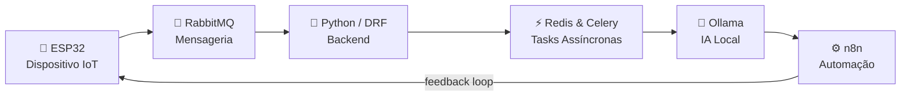

<div align="center">

# Renato David Soares de Oliveira

**Backend Developer • IoT Builder • Automation Enthusiast**

*"Construindo APIs durante o dia e inventando projetos malucos durante a noite."*

[](https://python.org)
[](https://djangoproject.com)
[](https://docker.com)
[](https://redis.io)
[](https://n8n.io)
[](https://espressif.com)
[](https://flutter.dev)
[](https://kubernetes.io)

</div>

---

## Sobre mim

Sou desenvolvedor back-end com foco em **Python** e **Django REST Framework**, trabalhando diariamente com APIs, processamento assíncrono, automações e infraestrutura baseada em containers.

Mas a verdade é que sempre fui atraído por projetos que misturam software e hardware. Desde os meus primeiros projetos com Arduino até aplicações mais complexas envolvendo IoT, robótica, visão computacional e inteligência artificial, gosto de construir sistemas que interagem com o mundo real.

Hoje exploro bastante automação com **n8n**, modelos locais de IA, agentes autônomos e arquiteturas distribuídas. Quando não estou desenvolvendo alguma API, provavelmente estou montando um novo projeto com ESP32, criando uma automação desnecessariamente complexa ou testando alguma tecnologia que achei interessante às 2 da manhã.


## O que eu construo




Projetos que unem software, hardware e automação.

---

## Stack Principal

```text
Backend      Python • Django • DRF • Celery • Redis
Infra        Docker • Linux • Git • Kubernetes
Automation   n8n • APIs • Workflows • AI Agents
AI           Ollama • LLMs Locais • RAG
Mobile       Flutter • Dart
Embedded     ESP32 • Raspberry Pi • Arduino • C++ • MicroPython
```

---

## Projetos que me representam

* Aplicações back-end escaláveis e automatizadas
* Sistemas IoT e monitoramento remoto
* Automação residencial
* Robótica e sistemas embarcados
* Aplicativos mobile com Flutter
* Agentes de IA e integrações inteligentes
* Ferramentas criadas para resolver problemas reais

## Projetos em Destaque

<table>
<tr>
<td width="50%">

### 🏙️ Guapó Cidadão
Aplicativo mobile desenvolvido em Flutter para aproximar cidadãos dos serviços da prefeitura.


</td>
<td width="50%">

### 🤖 Automação com IA
Fluxos inteligentes utilizando n8n, LLMs locais e integrações entre APIs.


</td>
</tr>
<tr>
<td width="50%">

### 🌦️ Estação Meteorológica Inteligente
Monitoramento ambiental com sensores, ESP32 e previsão baseada em IA.


</td>
<td width="50%">

### 🏆 Robótica Competitiva
Robôs seguidores de linha e sumô autônomo para competições. Medalhista 🥈 MOBFOG.


</td>
</tr>
</table>


---

## Atualmente explorando

<table>
<tr>
<td width="33%">

**🧠 IA Local**
- Ollama
- Agentes Autônomos
- Fluxos Inteligentes

</td>
<td width="33%">

**📡 IoT**
- Kubernetes para devices
- RabbitMQ
- Arquiteturas distribuídas

</td>
<td width="33%">

**⚙️ Automação**
- n8n
- Integrações empresariais
- Workflows orientados por IA

</td>
</tr>
</table>

---

## Algumas coisas sobre mim

- 🎓 Formado em Redes de Computadores
- 📚 Graduando em Análise e Desenvolvimento de Sistemas
- 🇺🇸 Inglês fluente
- 🥈 Medalhista de prata na MOBFOG
- 👨‍🏫 Ex-professor de Arduino, C++ e Python
- ⚙️ Apaixonado por hardware tanto quanto por software
- 🌙 Novos projetos surgem às 2 da manhã
- 🐱 Gatos participam ativamente do processo de desenvolvimento

---

## Filosofia

```python
while curiosity:
    learn()
    build()
    automate()
```

> A melhor forma de aprender uma tecnologia é encontrar um problema interessante e construir algo para resolvê-lo.

---

<div align="center">

*Feito com ☕ e muita automação*

</div>
